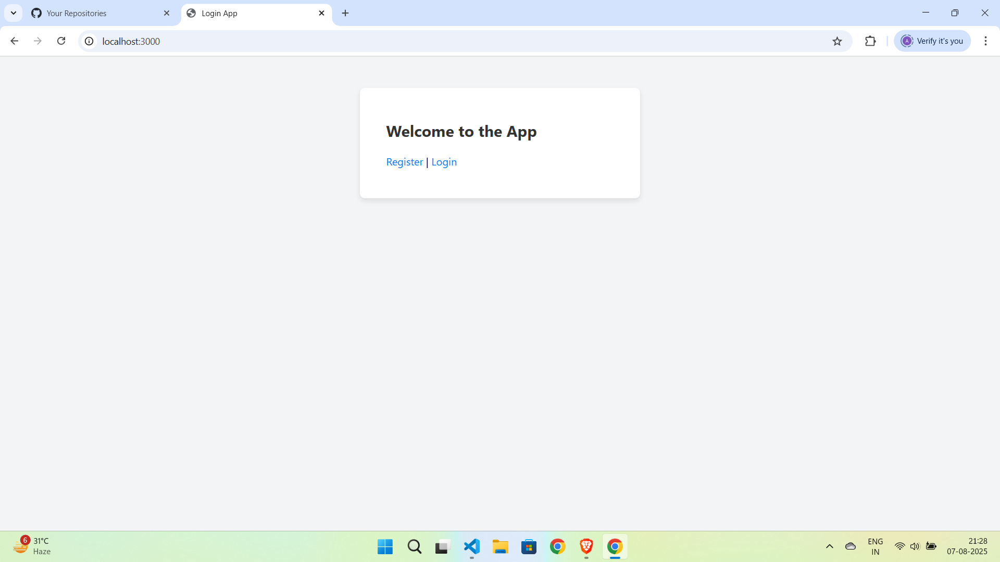
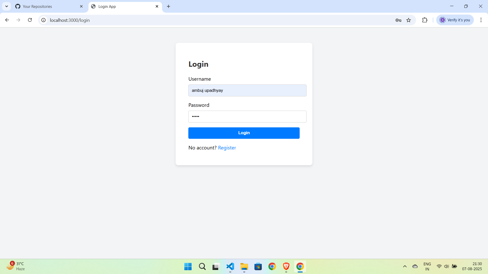
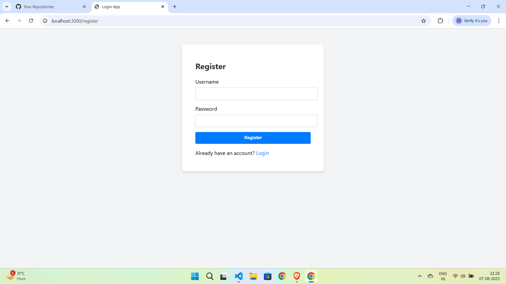
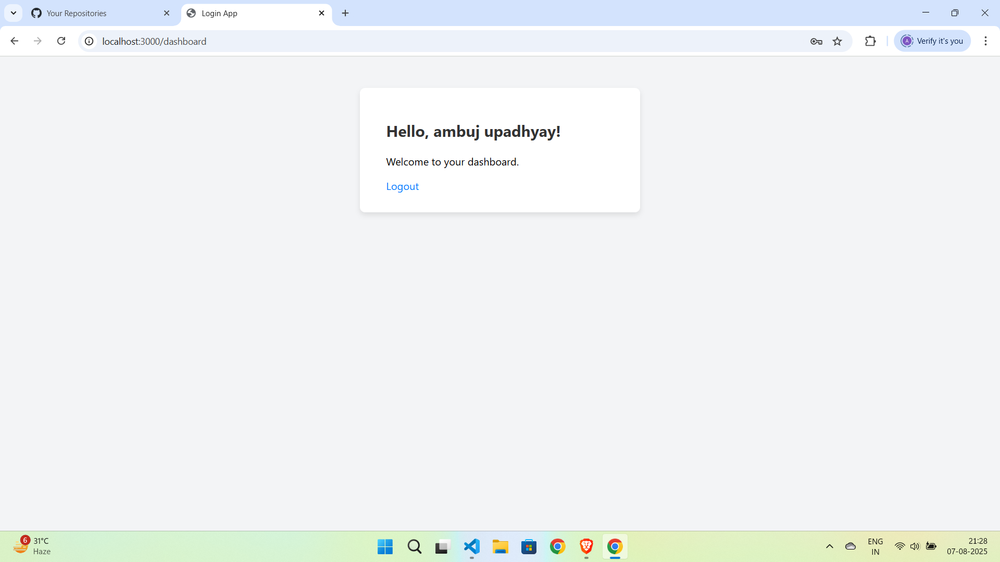

# 🔐 Basic Login Authentication Page

A simple and secure login authentication system built with **Node.js** and **Express.js**. It includes user registration, login, and password encryption using modern encryption techniques.

---

## 🚀 Features

- ✅ User Registration
- 🔐 Secure Login Authentication
- 🧠 Password Encryption (using `bcrypt` or similar)
- 🗂️ Session or Token-based Authentication (optional)
- 📦 Clean and modular code structure

---

## 🛠️ Technologies Used

- **Node.js** – JavaScript runtime
- **Express.js** – Web framework for Node.js
- **bcrypt.js** or **argon2** – For password encryption
- **body-parser** – Middleware for handling request bodies
- **express-session** or **jsonwebtoken (JWT)** – (optional) for session/token handling
- **EJS / HTML / CSS** – For front-end templating and styling

---
## 🧪 How It Works

1. **Register**: User signs up by entering their username and password.
2. **Encryption**: Password is encrypted using `bcrypt` before being stored.
3. **Login**: User logs in with credentials.
4. **Authentication**: Passwords are compared using the encrypted hash.
5. **Result**: If valid, the user is redirected to a protected page or dashboard.

---

## 💾 Installation and Usage

```bash
git clone https://github.com/your-username/login-auth-app.git
cd login-auth-app


npm install


node app.js








